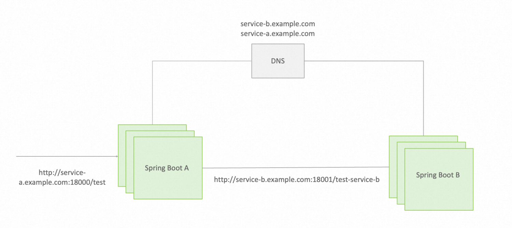

Spring Cloud 是在 Spring Boot 之上构建的一套微服务生态体系，包括服务发现、配置中心、限流降级、分布式事务、异步消息等，因此通过增加依赖、注解等简单的四步即可完成 Spring Boot 应用到 Spring Cloud 升级。

## Spring Boot 应用升级为 Spring Cloud

以下是应用升级 Spring Cloud 的完整步骤。

### 第一步：添加 Spring Cloud 依赖

首先，为应用添加 `Spring Cloud` 与 `Spring Cloud Alibaba` 依赖。注意根据当前应用 Spring Boot 版本选择合适的 Spring Cloud 版本，具体参见[版本映射表](#d2e0d790)。

```xml
<properties>
    <spring-cloud-alibaba.version>2022.0.0.0</spring-cloud-alibaba.version>
    <spring-cloud.version>2022.0.0</spring-cloud.version>
</properties>
<dependencyManagement>
    <dependencies>
        <dependency>
            <groupId>org.springframework.cloud</groupId>
            <artifactId>spring-cloud-dependencies</artifactId>
            <version>${spring-cloud.version}</version>
            <type>pom</type>
            <scope>import</scope>
        </dependency>
        <dependency>
            <groupId>com.alibaba.cloud</groupId>
            <artifactId>spring-cloud-alibaba-dependencies</artifactId>
            <version>${spring-cloud-alibaba.version}</version>
            <type>pom</type>
            <scope>import</scope>
        </dependency>
    </dependencies>
</dependencyManagement>
<dependencies>
    <!-- Nacos 服务发现 -->
    <dependency>
        <groupId>com.alibaba.cloud</groupId>
        <artifactId>spring-cloud-starter-alibaba-nacos-discovery</artifactId>
    </dependency>
    <!-- 服务发现：OpenFeign服务调用 -->
    <dependency>
        <groupId>org.springframework.cloud</groupId>
        <artifactId>spring-cloud-starter-openfeign</artifactId>
    </dependency>
  <!-- 服务发现：OpenFeign服务调用 -->
    <dependency>
        <groupId>org.springframework.cloud</groupId>
        <artifactId>spring-cloud-starter-loadbalancer</artifactId>
    </dependency>
</dependencies>
```

以上我们添加了`服务注册发现`、`OpenFeign` 等依赖。

### 第二步：添加配置

在应用 `application.yml`或者 `application.properties`文件中增加以下配置项，设置应用名、注册中心地址。

`application.yml`

```yaml
spring:
  application:
    #项目名称必填，在注册中心唯一
    #最好和之前域名规范、kubernetes service名等保持一致（会作为调用）
    name: service-provider
  cloud:
    nacos:
      discovery: #启用 spring cloud nacos discovery
        server-addr: 127.0.0.1:8848
```

`application.properties`

```properties
#项目名称必填，在注册中心唯一；最好和之前域名规范保持一致，第四步会讲到原因
spring.application.name=service-provider
#启用 spring cloud nacos discovery
spring.cloud.nacos.discovery.server-addr=127.0.0.1:8848
```

### 第三步：启动类增加注解

启动类增加 `EnableDiscoveryClient` `EnableFeignClients` 注解，启动服务地址自动注册与发现。

```java
@SpringBootApplication
@EnableDiscoveryClient
@EnableFeignClients
public class ProviderApplication {
    public static void main(String[] args) {
        SpringApplication.run(ProviderApplication.class, args);
    }
}
```

### 第四步：调整服务调用方式

> **注意！**
> 1. 为了保证平滑升级，请确保下游应用完成 Spring Cloud 改造并在注册中心注册服务后再进行调用方式改造。
> 2. RestTemplate/FeignClient 默认发起调用的 `hostname (示例中的service-provider)`是对端 Spring Cloud 应用名。因此，为了保证尽可能少的改造量，改造过程中设置的应用名 `spring.name=service-provider` 最好和之前的命名规范保持一致。比如：
>    - 如果之前有自定义域名，则和域名定义保持一致
>    - 如果之前用的 Kubernetes Service，则和 Service Name 保持一致

1. **RestTemplate 模式**

为之前的 RestTemplate Bean 添加 `@LoadBlanced` 注解，使得 RestTemplate 接入服务发现与负载均衡：

```java
@Bean
@LoadBalanced
public RestTemplate restTemplate() {
    return new RestTemplate();
}
```

其它原有 `RestTemplate` 发起调用的代码保持不变，只需调整 hostname 即可，如下所示。

```java
@RestController
 public class TestController {

    @Autowired
    private RestTemplate restTemplate;

    @GetMapping(value = "/echo-rest/{str}")
    public String rest(@PathVariable String str) {
        return restTemplate.getForObject("http://service-provider/echo/" + str, String.class);
    }
}
```

2. **FeignClient 模式**

使用 `@FeignClient` 注解将 EchoService 这个接口包装成一个 FeignClient，属性 name 对应对端应用名 `spring.name=service-provider`。

```java
//@FeignClient(name = "service-provider", url="http://service.example.com/")
@FeignClient(name = "service-provider")
public interface EchoService {
    @GetMapping(value = "/echo/{str}")
    String echo(@PathVariable("str") String str);
}
```

将 EchoService 作为标准 bean 注入，即可对远端服务发起请求了。

```java
@RestController
 public class TestController {

    @Autowired
    private EchoService echoService;

    @GetMapping(value = "/echo-feign/{str}")
    public String feign(@PathVariable String str) {
        return echoService.echo(str);
    }
}
```

3. **HtClient、自定义HTTP访问工具等**

对于使用 HttpClient 或者自行封装 http 调用工具的用户，建议统一改造为以上 1、2 两种调用模式之一。

## 参考资料

### 完整示例源码

基于 Spring Boot 构建的应用架构变化多样，比如可能是以下一些常用架构的任意一种，但不论哪种架构，升级 Spring Cloud 的大致改造方式都是类似的（都可以转为基于 Nacos 注册中心的地址发现与负载均衡）。

- 基于 DNS 自定义域名，服务间的通过域名调用实现负载均衡
- 基于 SLB 的中心化流量转发，调用直接转发到 SLB，由 SLB 实现在服务间实现流量转发
- 基于 Kubernetes Service 微服务体系，依赖 Kubernetes ClusterIP 等实现负载均衡与调用转发

在此，我们以 DNS 自定义域名架构为例，提供了一个 Spring Boot 到 Spring Cloud 升级改造的完整示例，升级前后的应用架构图如下。具体可参见 [Github 源码链接](https://github.com/spring-cloud-alibaba-group/springboot-transfer-to-springcloud)。


_升级前 SpringBoot 架构 👆_


_升级后 SpringCloud 架构 _👆

### Spring Boot 与 Spring Cloud Alibaba 版本对应关系

请根据您使用的 Spring Boot 版本，选择兼容的 Spring Cloud Alibaba 版本

| **Spring Boot Version** | **Spring Cloud Alibaba Version** | **Spring Cloud Version** |
| --- | --- | --- |
| 3.0.2 | 2022.0.0.0 | Spring Cloud 2022.0.0 |
| 3.0.2 | 2022.0.0.0-RC2 | Spring Cloud 2022.0.0 |
| 3.0.0 | 2022.0.0.0-RC1 | Spring Cloud 2022.0.0 |
| 2.6.13 | 2021.0.5.0 | Spring Cloud 2021.0.5 |
| 2.6.11 | 2021.0.4.0 | Spring Cloud 2021.0.4 |
| 2.6.3 | 2021.0.1.0 | Spring Cloud 2021.0.1 |
| 2.4.2 | 2021.1 | Spring Cloud 2020.0.1 |
| 2.3.12.RELEASE | 2.2.10-RC1 | Spring Cloud Hoxton.SR12 |
| 2.3.12.RELEASE | 2.2.9.RELEASE | Spring Cloud Hoxton.SR12 |
| 2.3.12.RELEASE | 2.2.8.RELEASE | Spring Cloud Hoxton.SR12 |
| 2.3.12.RELEASE | 2.2.7.RELEASE | Spring Cloud Hoxton.SR12 |
| 2.3.2.RELEASE | 2.2.6.RELEASE | Spring Cloud Hoxton.SR9 |
| 2.2.5.RELEASE | 2.2.1.RELEASE | Spring Cloud Hoxton.SR3 |
| 2.2.X.RELEASE | 2.2.0.RELEASE | Spring Cloud Hoxton.RELEASE |
| 2.1.13.RELEASE | 2.1.4.RELEASE | Spring Cloud Greenwich.SR6 |
| 2.1.X.RELEASE | 2.1.2.RELEASE | Spring Cloud Greenwich |
| 2.0.X.RELEASE | 2.0.4.RELEASE(停止维护，建议升级) | Spring Cloud Finchley |
| 1.5.X.RELEASE | 1.5.1.RELEASE(停止维护，建议升级) | Spring Cloud Edgware |

### Spring Cloud Alibaba Starters 列表与使用手册

- [spring-cloud-starter-alibaba-nacos-discovery](https://sca.aliyun.com/zh-cn/docs/next/user-guide/nacos/quick-start#%E6%8E%A5%E5%85%A5-nacos-%E6%9C%8D%E5%8A%A1%E6%B3%A8%E5%86%8C%E4%B8%8E%E5%8F%91%E7%8E%B0)
- [spring-cloud-starter-alibaba-nacos-config](https://sca.aliyun.com/zh-cn/docs/next/user-guide/nacos/quick-start#%E6%8E%A5%E5%85%A5-nacos-%E9%85%8D%E7%BD%AE%E4%B8%AD%E5%BF%83)
- [spring-cloud-starter-alibaba-nacos-sentinel](https://sca.aliyun.com/zh-cn/docs/next/user-guide/sentinel/quick-start)
- [spring-cloud-starter-alibaba-nacos-rocketmq](https://sca.aliyun.com/zh-cn/docs/next/user-guide/rocketmq/quick-start)
- [spring-cloud-starter-alibaba-nacos-seata](https://sca.aliyun.com/zh-cn/docs/next/user-guide/seata/quick-start)

### Spring Cloud Alibaba 集成的组件版本

每个 Spring Cloud Alibaba 版本及其自身所适配的各组件对应版本如下表所示

| **Spring Cloud Alibaba Version** | **Sentinel Version** | **Nacos Version** | **RocketMQ Version** | **Dubbo Version** | **Seata Version** |
| --- | --- | --- | --- | --- | --- |
| 2022.0.0.0 | 1.8.6 | 2.2.1 | 4.9.4 | ~ | 1.7.0 |
| 2022.0.0.0-RC2 | 1.8.6 | 2.2.1 | 4.9.4 | ~ | 1.7.0-native-rc2 |
| 2021.0.5.0 | 1.8.6 | 2.2.0 | 4.9.4 | ~ | 1.6.1 |
| 2.2.10-RC1 | 1.8.6 | 2.2.0 | 4.9.4 | ~ | 1.6.1 |
| 2022.0.0.0-RC1 | 1.8.6 | 2.2.1-RC | 4.9.4 | ~ | 1.6.1 |
| 2.2.9.RELEASE | 1.8.5 | 2.1.0 | 4.9.4 | ~ | 1.5.2 |
| 2021.0.4.0 | 1.8.5 | 2.0.4 | 4.9.4 | ~ | 1.5.2 |
| 2.2.8.RELEASE | 1.8.4 | 2.1.0 | 4.9.3 | ~ | 1.5.1 |
| 2021.0.1.0 | 1.8.3 | 1.4.2 | 4.9.2 | ~ | 1.4.2 |
| 2.2.7.RELEASE | 1.8.1 | 2.0.3 | 4.6.1 | 2.7.13 | 1.3.0 |
| 2.2.6.RELEASE | 1.8.1 | 1.4.2 | 4.4.0 | 2.7.8 | 1.3.0 |
| 2021.1 or 2.2.5.RELEASE or 2.1.4.RELEASE or 2.0.4.RELEASE | 1.8.0 | 1.4.1 | 4.4.0 | 2.7.8 | 1.3.0 |
| 2.2.3.RELEASE or 2.1.3.RELEASE or 2.0.3.RELEASE | 1.8.0 | 1.3.3 | 4.4.0 | 2.7.8 | 1.3.0 |
| 2.2.1.RELEASE or 2.1.2.RELEASE or 2.0.2.RELEASE | 1.7.1 | 1.2.1 | 4.4.0 | 2.7.6 | 1.2.0 |
| 2.2.0.RELEASE | 1.7.1 | 1.1.4 | 4.4.0 | 2.7.4.1 | 1.0.0 |
| 2.1.1.RELEASE or 2.0.1.RELEASE or 1.5.1.RELEASE | 1.7.0 | 1.1.4 | 4.4.0 | 2.7.3 | 0.9.0 |
| 2.1.0.RELEASE or 2.0.0.RELEASE or 1.5.0.RELEASE | 1.6.3 | 1.1.1 | 4.4.0 | 2.7.3 | 0.7.1 |
